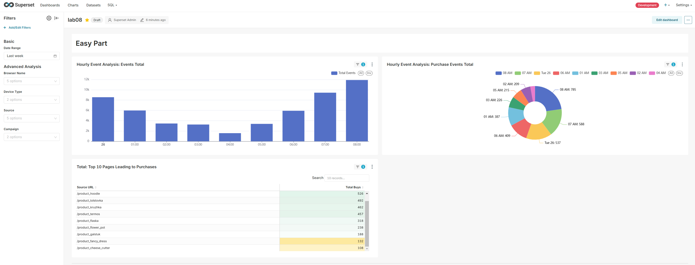
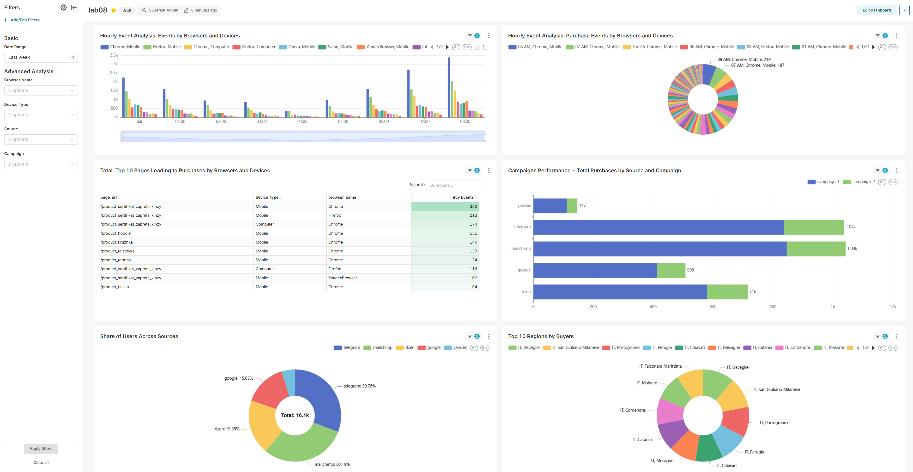

# Поток данных на базе Dagster

Этот репозиторий содержит поток данных, построенный на базе Dagster, который предназначен для обработки и агрегации данных событий, хранящихся в S3, и их загрузки в ClickHouse для аналитики. Поток считывает файлы из S3 bucket'а, обрабатывает их и выполняет различные агрегации событийных данных.

## Содержание

- [Обзор](#обзор)
- [Необходимые условия](#необходимые-условия)
- [Переменные окружения](#переменные-окружения)
- [Компоненты](#компоненты)
- [Как запустить](#как-запустить)

## Обзор

Поток данных в Dagster состоит из нескольких операций (опов), выполняющих следующие задачи:

1. **Получение файлов**: Извлечение имен файлов из S3-bucket'а в заданном диапазоне дат.
2. **Обработка файлов**: Обработка файлов и загрузка их данных в ClickHouse.
3. **Агрегация данных**: Агрегация событийных данных в несколько агрегированных таблиц в ClickHouse, включая данные о браузерах и устройствах, событиях компаний и статистике пользователей на основе географических регионов.

## Необходимые условия

Перед запуском потока данных убедитесь, что у вас установлено следующее:

- Python 3.7 или выше
- Docker и Docker Compose (если вы используете Docker для локальной разработки)

Также вам нужно установить необходимые пакеты Python. Вы можете сделать это, выполнив:

```
bash
pip install -r requirements.txt

```

## Переменные окружения

Поток данных использует несколько переменных окружения для конфигурации. Вы можете определить их в файле `.env` в корневом каталоге вашего проекта:

```
KEY_ID=ваш_aws_key_id
KEY_VALUE=ваш_aws_secret_key
ENDPOINT_URL=ваш_s3_endpoint_url
BUCKET_NAME=ваше_s3_bucket_name

CLICKHOUSE_USER=ваш_clickhouse_user
CLICKHOUSE_PASSWORD=ваш_clickhouse_password
CLICKHOUSE_DATABASE=ваш_clickhouse_database
HOST=ваш_clickhouse_host
PORT=ваш_clickhouse_port
```

## Компоненты

- **get_filename**: Операция для извлечения списка файлов в указанном диапазоне дат из S3-ведра.
- **process_files**: Обрабатывает каждый файл, извлекает данные и загружает их в базу данных ClickHouse в соответствии с заранее определенными сопоставлениями для различных типов событий.
- **Агрегации**: Несколько операций, которые агрегируют данные в разные таблицы в ClickHouse на основе различных критериев, таких как тип устройства, имя браузера и географическая информация.

Ключевые операции включают в себя:

- `browser_device_hourly_events_agg`: Количество купленных товаров в разрезе часа.
- `browser_device_hourly_buy_leading_pages_agg`: Топ-10 посещённых страниц, с которых был переход в покупку — список ссылок с количеством покупок.
- `source_campaign_buy_events_agg`: Покупки по источника.
- `hourly_sources_users_agg`: Агрегация уникальных пользователей на основе информации о источниках.
- `hourly_country_regions_users_agg`: Агрегация уникальных пользователей на основе географических регионов.

## Конфигурация job'a

Основной job определяется как `npl_job`. Этот job настроен на прием диапазона дат в качестве ввода и будет вызывать соответствующие операции для выполнения обработки и агрегации.

Job определяется следующим образом:

```
python
@job(config=ConfigMapping(
config_schema={“start_date”: str, “end_date”: str},
config_fn=config_mapping_fn
),
executor_def=multiprocess_executor.configured({
‘max_concurrent’: 5
}),
)
def npl_job():
…

```

## Описание op'ов:
1. `get_filename` - Идет по s3 бакету и возвращает названия файлов указанные в диапазоне конфига. Использует `yield` для динамического выполнения следующего шага
2. `process_files` - Формируется динамически на основе названия файла, полученного из `get_filename`.
Загружает файл в память разархивирует его и загружает в Clickhouse.
3. В op `browser_device_hourly_events_agg`, `browser_device_hourly_buy_leading_pages_agg`
`source_campaign_buy_events_agg`,
`hourly_sources_users_agg`,
`hourly_country_regions_users_agg` - рассчитываеются соответствующие витрины для визуализации в SuperSet.

## Как запустить

1. Убедитесь, что ваша среда настроена правильно со всеми необходимыми переменными.
2. Запустите сервер Dagster для мониторинга выполнения потока:

```
dagster dev
```

3. Запустите ваше задание через  через UI Dagster. 
Для этого config по примеру:
```
{start_date: 2020-01-01, end_date: 2025-11-01}
```


# Superset Dashboard README

## Overview

This overview provides a detailed guide to the **lab08** dashboard, including information about the datasets, charts, and interactive features. The dashboard consists of two parts:

1. **Easy Part**: Focused on high-level analytics of hourly events, purchases, and leading to purchase pages.
   
2. **Harder Part**: Provides advanced breakdowns of performance by browsers, devices, campaigns, and regions.
   

---

## About the Dashboard

### Purpose

The dashboard is designed to:

- Provide insights into user events and purchase behaviors.
- Highlight key performance metrics by time, pages, sources, devices, and regions.

### Key Questions Answered

- When are users most active?
- Which pages drive the most purchases?
- How do different browsers, devices, and campaigns perform?
- What are the most effective regions and traffic sources?

### Target Audience

- **Marketing Teams**: To analyze traffic and campaign performance.
- **Product Teams**: To optimize user journeys and high-performing pages.

---

## Charts Overview

### Easy Part

#### 1. Hourly Event Analytics: Events Total

- **Type**: Bar Chart
- **Purpose**: Displays the total number of events recorded per hour.
- **Key Metrics**: Total Events
- **How to Use**: Identify peak activity hours.

#### 2. Hourly Event Analytics: Purchases Events Total

- **Type**: Pie Chart
- **Purpose**: Breaks down purchase events by hour.
- **Key Metrics**: Number of purchases per hour.
- **How to Use**: Track the most frequent purchase hours.

#### 3. Total: Top 10 Pages Leading to Purchases

- **Type**: Table
- **Purpose**: Highlights the top pages that lead to purchases.
- **Key Metrics**:
  - Page URL
  - Total Buys
- **How to Use**: Optimize content and UX on high-performing pages.

---

### Harder Part

#### 4. Hourly Event Analytics: Events by Browser and Device

- **Type**: Bar Chart
- **Purpose**: Displays hourly events segmented by browser and device type.
- **Key Metrics**: Event Counts, Browser/Device Combinations
- **How to Use**: Identify device-browser combinations driving engagement.

#### 5. Hourly Event Analytics: Purchases by Browser and Device

- **Type**: Pie Chart
- **Purpose**: Shows purchase events segmented by browser and device type.
- **Key Metrics**: Purchase Counts
- **How to Use**: Focus on high-performing device-browser combinations.

#### 6. Top 10 Pages Leading to Purchases by Browsers and Devices

- **Type**: Table
- **Purpose**: Highlights the top pages that lead to purchases by browser and device type.
- **Key Metrics**:
  - Page URL
  - Device Type
  - Browser Name
  - Buy Events
- **How to Use**: Improve UX for specific device-browser combinations.

#### 7. Campaign Performance: Total Purchases by Source

- **Type**: Stacked Bar Chart
- **Purpose**: Displays total purchases by source, segmented by campaign.
- **Key Metrics**: Purchases by Campaign/Source
- **How to Use**: Evaluate marketing channel and campaign effectiveness.

#### 8. Share of Users Across Sources

- **Type**: Pie Chart
- **Purpose**: Shows the distribution of user traffic by source.
- **Key Metrics**: User Share by Source
- **How to Use**: Identify dominant traffic sources for targeting strategies.

#### 9. Top 10 Regions by Purchases

- **Type**: Pie Chart
- **Purpose**: Highlights the top 10 regions contributing to purchases.
- **Key Metrics**: Purchases by Region
- **How to Use**: Focus marketing efforts on top-performing regions.

---

## How to Use the Dashboard

### Filters

- **Available Filters**:
  - Date Range: Select a custom time period, by default last day.
  - Browser/Device Type: Select specific combinations.
  - Source: Filter by traffic source (e.g., Instagram, Google).
  - Campaign: Filter by campaign (e.g., campaign_1, campaign_2).
- **How to Apply Filters**:
  - Click on a filter dropdown and select the desired value(s).
  - Related to the filter charts will be highlighted and updated based on the filter selection.

### Interactive Features

- **Data Zoom**: Zoom overwhelming graphs.
- **Hover Tooltips**: Hover over chart elements to view additional details.
- **Cross-Filtering**: Selecting data in one chart dynamically updates other related charts.

### Exporting Data

1. **Exporting Chart Data**:
   - Hover over a chart and click the **Ellipsis Menu (⋮)**.
   - Select **Export CSV** to download the chart's underlying data.
2. **Exporting the Dashboard**:
   - Use the **Export** button at the top to download the dashboard as a PDF or image.

---

## Notes

- *This dashboard is updated daily.